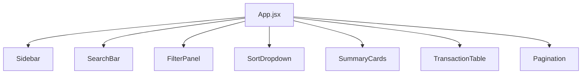
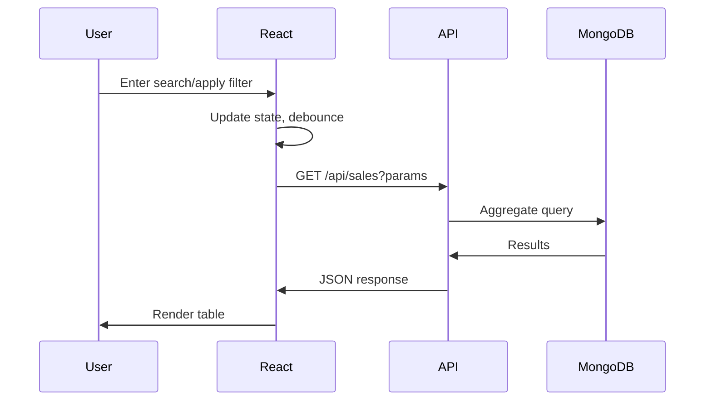

# Architecture Document

## Overview

This document describes the architecture of the Retail Sales Management System, a full-stack web application for managing sales data with advanced search, filtering, sorting, and pagination capabilities.

**Live Application:** https://truestate-sdia.vercel.app/

---

## Backend Architecture

### Technology Stack
- **Node.js** - Runtime environment
- **Express.js** - Web framework
- **MongoDB** - NoSQL database
- **Mongoose** - ODM for MongoDB

### Design Pattern
The backend follows the **MVC (Model-View-Controller)** pattern:

```
backend/
├── src/
│   ├── controllers/    # Handle HTTP requests
│   ├── services/       # Business logic
│   ├── models/         # Database schemas
│   ├── routes/         # API endpoints
│   ├── utils/          # Helper functions
│   └── index.js        # Entry point
├── .env                # Environment variables
└── package.json
```

### Module Responsibilities

| Module | Responsibility |
|--------|---------------|
| `index.js` | Server initialization, MongoDB connection, middleware setup |
| `models/Sale.js` | Mongoose schema with indexes for search performance |
| `services/salesService.js` | Query building, aggregations, pagination logic |
| `controllers/salesController.js` | Request handling, response formatting |
| `routes/salesRoutes.js` | API endpoint definitions |
| `utils/importData.js` | CSV to MongoDB data import |

### API Endpoints

| Method | Endpoint | Description |
|--------|----------|-------------|
| GET | `/api/sales` | Fetch sales with search, filters, sort, pagination |
| GET | `/api/sales/filters` | Get unique values for filter dropdowns |

---

## Frontend Architecture

### Technology Stack
- **React 18** - UI library
- **Vite** - Build tool
- **Tailwind CSS** - Styling
- **Lucide React** - Icons
- **Axios** - HTTP client

### Design Pattern
Component-based architecture with centralized state management:

```
frontend/
├── src/
│   ├── components/     # Reusable UI components
│   ├── services/       # API communication
│   ├── utils/          # Helper functions
│   ├── App.jsx         # Main component with state
│   ├── main.jsx        # Entry point
│   └── index.css       # Global styles
├── public/
└── package.json
```

### Component Structure



### State Management

All state is managed in `App.jsx` using React hooks:

| State | Purpose |
|-------|---------|
| `search` | Search query string |
| `filters` | Object containing all filter values |
| `sort` | Sort field and order |
| `page` | Current page number |
| `data` | Sales records from API |
| `pagination` | Pagination metadata |
| `summary` | Aggregated statistics |

---

## Data Flow



### Request Flow

1. User interacts with search/filter/sort/pagination
2. React state updates trigger `useEffect`
3. API call made with query parameters
4. Express controller receives request
5. Service layer builds MongoDB query
6. Results returned with pagination info
7. React updates UI with new data

---

## Database Schema

### Sales Collection

```javascript
{
  transactionId: Number,
  date: Date,
  customerId: String,
  customerName: String,      // Text indexed
  phoneNumber: String,       // Text indexed
  gender: String,
  age: Number,
  customerRegion: String,
  customerType: String,
  productId: String,
  productName: String,
  brand: String,
  productCategory: String,
  tags: [String],
  quantity: Number,
  pricePerUnit: Number,
  discountPercentage: Number,
  totalAmount: Number,
  finalAmount: Number,
  paymentMethod: String,
  orderStatus: String,
  deliveryType: String,
  storeId: String,
  storeLocation: String,
  salespersonId: String,
  employeeName: String
}
```

### Indexes
- Text index on `customerName`, `phoneNumber` for search
- Compound index on `customerRegion`, `gender`, `productCategory`
- Index on `date` for sorting

---

## Folder Structure

```
root/
├── backend/
│   ├── src/
│   │   ├── controllers/
│   │   │   └── salesController.js
│   │   ├── services/
│   │   │   └── salesService.js
│   │   ├── models/
│   │   │   └── Sale.js
│   │   ├── routes/
│   │   │   └── salesRoutes.js
│   │   ├── utils/
│   │   │   └── importData.js
│   │   └── index.js
│   ├── .env
│   ├── package.json
│   └── README.md
│
├── frontend/
│   ├── src/
│   │   ├── components/
│   │   │   ├── Sidebar.jsx
│   │   │   ├── SearchBar.jsx
│   │   │   ├── FilterPanel.jsx
│   │   │   ├── SortDropdown.jsx
│   │   │   ├── SummaryCards.jsx
│   │   │   ├── TransactionTable.jsx
│   │   │   └── Pagination.jsx
│   │   ├── services/
│   │   │   └── api.js
│   │   ├── utils/
│   │   │   └── helpers.js
│   │   ├── App.jsx
│   │   ├── main.jsx
│   │   └── index.css
│   ├── public/
│   ├── package.json
│   └── README.md
│
├── docs/
│   └── architecture.md
│
└── README.md
```
